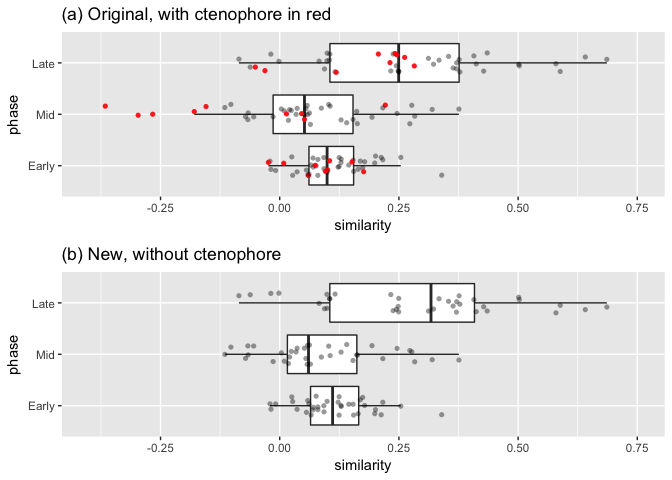

Levin *et al.* reanalyses
=========================

by [Casey W. Dunn](http://dunnlab.org/)

Please see the [git repository](https://github.com/caseywdunn/levin2016) for additional files related to this document, including data and [source code for all analyses](https://github.com/caseywdunn/levin2016/blob/master/reanalyses.rmd).

This notebook describes reanalyses of Levin *et al*. 2016:

> Levin M, Anavy L, Cole AG, Winter E, Mostov N, Khair S, Senderovich N, Kovalev E, Silver DH, Feder M, et al. 2016. The mid-developmental transition and the evolution of animal body plans. Nature 531: 637-641. [doi:10.1038/nature16994](http://dx.doi.org/10.1038/nature16994)

We addressed concerns regarding the study design of Levin *et al*. in a previous manuscript:

> Hejnol A, Dunn CW, 2016. Animal Evolution: Are Phyla Real? Current Biology 26:R424-R426. [doi:10.1016/j.cub.2016.03.058](http://dx.doi.org/10.1016/j.cub.2016.03.058)

Here we examine support for their central finding - the inverse hourglass model.

Figure 4d data
--------------

This box plot corresponds to that of Levin *et al.* [Figure 4d](http://www.nature.com/nature/journal/v531/n7596/fig_tab/nature16994_F4.html): 

The KS p-value for the early-mid comparison is 0.00298, while the p-value for the late-mid comparison is 3.27e-06. The KS tests as reproduced here are still significant, but the p values are much less significant than those published by Levin *et al.*:

> we found that the mid-developmental transition profiles are significantly less conserved than the early and late phase expression (Fig. 4d, P<10-6 compared with the early phase and P<10-12 with the late phase, Kolmogorov–Smirnov test)

Question: How was the published P value calculated? Was it two sided? Was it on a different data set?

Levin *et al.* answer: They used a a two-sided KS test in matlab:

    [i,j]=kstest2(S(:,2),S(:,1)); ['P-value: early to switch: ' mat2str(j)]
    [i,j]=kstest2(S(:,2),S(:,3)); ['P-value: late to switch: ' mat2str(j)]

To compare my new results as closely as possible with their published results, I ran the following in matlab (version R2016a):

    # With duplicated values
    B = tdfread('Figure_4d_data_full.txt')
    [i,p]=kstest2(B.Early,B.Mid)
    # p = 3.1161e-06
    [i,p]=kstest2(B.Late,B.Mid)
    # p = 5.3257e-12

The matlab ks test p values are the same orders of magnitude as the published results (10<sup>-6</sup> for early-mid and 10<sup>-12</sup> for early-late) when analyzing the `Figure_4d_data_full.txt` file obtained from the authors. This shows I can reproduce their result. The problem, though, is that every pairwise comparison is represented twice in this file. Each species was compared to every other species, but both reciprocal comparisons (which have the same values) were retained. For example, there is an entry for both a `Nematodes` to `Arthropods` comparison and a `Arthropods` to `Nematodes` comparison. Both these comparisons have the same values. As a consequence, there are 90 entries for the 45 pairwise comparisons. These duplicate values inflates the p values by several orders of magnitude as it seems that twice the actual data are available.

I derived the `Figure_4d_data.txt` file from `Figure_4d_data_full.txt` by removing duplicate pairwise comparisons. The KS test on this non-redundant file returns p values that are orders of magnitude greater (i.e., less significant) than those published (0.002 for early-mid and 10<sup>-6</sup> for early-late):

    # Without duplicated values
    A = tdfread('Figure_4d_data.txt')
    [i,p]=kstest2(A.Early,A.Mid)
    # p = 0.0022
    [i,p]=kstest2(A.Late,A.Mid)
    # p = 2.5199e-06

The R and matlab results are consistent with each other when analyzing `Figure_4d_data.txt`, indicating that my results don't differ from those of Levin *et al.* due to software differences and that the discrepancy is due to the duplicated values.

### Evaluating the test method

The primary result of Levin *et al.*, *i.e.* support for the inverse hourglass model, is based on the box plot in their [Figure 4d](http://www.nature.com/nature/journal/v531/n7596/fig_tab/nature16994_F4.html) and the corresponding KS tests. In this figure, the box plots for each temporal phase largely overlap and there is little differentiation between the distributions. The published KS tests did reject the hypothesis that the early and late distributions are drawn from the same distribution as the mid phase, though the result was much less significant when correcting for duplicate values as described above. There are a couple fundamental problems using the KS test in this context, though:

-   The KS test does not just test whether one distribution is greater than the other, it tests if the distributions are the same. This takes into consideration other features, such as distribution shape. This is a much more specific null hypothesis than that discussed in the paper (that they have the same mean). The null hypothesis would be rejected if the two distributions had the same mean but different variances, for example.

-   The samples in this dataset are matched - for each pairwise comparison there is a early, mid, and late expression value. The KS test is for unmatched samples. In this study, the question is not whether the distributions are the same, as the KS test can evaluate, but whether each value in one phase (early, late) tends to be higher than its matched value in the mid phase. The Wilcoxon test is appropriate for this question.

Here I rerun the analyses taking the matched samples into account.

The p-values for the Wilcoxon test are 0.0201 for the early-mid comparison, which is barely significant, and 1.5e-07 for the late-mid comparison.

Levin *et al.* comment: "I think you make a good point regarding the KS test, that significance could result even when the means are the same. We used it in the paper as two-sided non-parametric test to quantify a P-value for the distributions which we found to have different means (Figure 4d)."

### Evaluation of support across taxa

Their [Figure 4d](http://www.nature.com/nature/journal/v531/n7596/fig_tab/nature16994_F4.html) shows that the the medians are close in value for the three phases, but the mid phase includes three low outliers. These outliers are much lower than any values in the other phases.

Here I order the matrix by Mid to identify these values:

``` r
    D[order(D[,4]),]
```

    ##          Species_A       Species_B        Early          Mid         Late
    ## 9         Porifera     Ctenophores  0.100669010 -0.365911105  0.282274760
    ## 30 Platyhelminthes     Ctenophores  0.176048183 -0.296976495  0.245652535
    ## 44   Echinodermata     Ctenophores -0.023795341 -0.266368073 -0.030996149
    ## 35     Tardigrades     Ctenophores  0.060444163 -0.179198381  0.206867861
    ## 17       Nematodes     Ctenophores  0.151644730 -0.154586004  0.262058747
    ## 3         Porifera Platyhelminthes  0.155002540 -0.115087642  0.376311386
    ## 37        Cnidaria   Echinodermata  0.036376979 -0.102378319  0.099007023
    ## 12       Nematodes     Tardigrades  0.199298060 -0.071681054  0.588376047
    ## 20      Arthropods        Cnidaria  0.124601183 -0.066713460  0.249691243
    ## 8         Porifera        Chordata  0.069772595 -0.066213097  0.377994992
    ## 28 Platyhelminthes   Echinodermata -0.018322139 -0.054610068 -0.018613936
    ## 38        Cnidaria        Chordata  0.061347364 -0.013834099  0.104426878
    ## 11       Nematodes Platyhelminthes  0.153848279  0.003386168  0.334204105
    ## 29 Platyhelminthes        Chordata  0.168995658  0.009568790  0.249535577
    ## 42       Annelides     Ctenophores  0.074431717  0.014218651  0.231343312
    ## 1         Porifera       Nematodes  0.129054667  0.018285677  0.502489222
    ## 27 Platyhelminthes       Annelides  0.178117430  0.020705902  0.371156381
    ## 31     Tardigrades        Cnidaria  0.065837022  0.024317831  0.233005198
    ## 23      Arthropods        Chordata  0.174030662  0.034302506  0.311989233
    ## 22      Arthropods   Echinodermata  0.080145032  0.036502128  0.116021389
    ## 45        Chordata     Ctenophores  0.095760272  0.046039046  0.241904751
    ## 24      Arthropods     Ctenophores  0.104613567  0.051936282  0.118511760
    ## 4         Porifera     Tardigrades  0.058871151  0.051953440  0.501257659
    ## 13       Nematodes        Cnidaria  0.144822748  0.054946204  0.248513469
    ## 43   Echinodermata        Chordata  0.056002062  0.057577276  0.082635717
    ## 21      Arthropods       Annelides  0.164550134  0.058470506  0.427871167
    ## 7         Porifera   Echinodermata -0.020415436  0.062366032 -0.085539385
    ## 10       Nematodes      Arthropods  0.339814248  0.064395702  0.435217950
    ## 2         Porifera      Arthropods  0.076481986  0.087351405  0.363660703
    ## 5         Porifera        Cnidaria -0.008534650  0.102751777 -0.061848072
    ## 15       Nematodes   Echinodermata  0.092535943  0.105802951  0.237897825
    ## 33     Tardigrades   Echinodermata  0.025357692  0.128720503  0.105286114
    ## 25 Platyhelminthes     Tardigrades  0.124680505  0.140468139  0.412204651
    ## 18      Arthropods Platyhelminthes  0.201030460  0.153772347  0.244670922
    ## 16       Nematodes        Chordata  0.216278291  0.161469261  0.322650773
    ## 40       Annelides   Echinodermata  0.027186266  0.162751608  0.093876992
    ## 34     Tardigrades        Chordata  0.099379793  0.193583992  0.370560938
    ## 41       Annelides        Chordata  0.122490104  0.216293598  0.354166886
    ## 39        Cnidaria     Ctenophores  0.008475209  0.221423108 -0.051209207
    ## 14       Nematodes       Annelides  0.212850406  0.246272030  0.579396682
    ## 36        Cnidaria       Annelides  0.079973868  0.272973837  0.099517962
    ## 32     Tardigrades       Annelides  0.128565010  0.277032925  0.640936308
    ## 26 Platyhelminthes        Cnidaria  0.070462181  0.283220473 -0.001628348
    ## 19      Arthropods     Tardigrades  0.253967927  0.319843060  0.686180618
    ## 6         Porifera       Annelides  0.092859609  0.375836473  0.407266049

The five lowest mid values, including the three outliers, are pairwise comparisons that include the ctenophore. Here I rerun the analyses without ctenophores:

``` r
    D_no_ct = D[ ((D$Species_A != "Ctenophores") &   (D$Species_B != "Ctenophores")), ]
    boxplot(as.matrix(D_no_ct[,3:5]))
```


``` r
    wilcox.test(D_no_ct$Early, D_no_ct$Mid, alternative="greater", paired=T)
```

    ## 
    ##  Wilcoxon signed rank test
    ## 
    ## data:  D_no_ct$Early and D_no_ct$Mid
    ## V = 402, p-value = 0.1428
    ## alternative hypothesis: true location shift is greater than 0

``` r
    wilcox.test(D_no_ct$Late, D_no_ct$Mid, alternative="greater", paired=T)
```

    ## 
    ##  Wilcoxon signed rank test
    ## 
    ## data:  D_no_ct$Late and D_no_ct$Mid
    ## V = 599, p-value = 3.005e-06
    ## alternative hypothesis: true location shift is greater than 0

There is no significant difference between the early and mid phase.

### Summary figures



    ## quartz_off_screen 
    ##                 2

### Overview of comparisons

<a name="overview"></a>

Based in the results shown in their [Figure 4d](http://www.nature.com/nature/journal/v531/n7596/fig_tab/nature16994_F4.html), Levin *et al.* concluded that the "mid" distribution was significantly less than the "early" and "late" distributions, and that a low "mid" value is a general evolutionary pattern for animals.

When all the annotated points are shown in the interactive plot below, however, it becomes apparent that minimum similarity at the "mid" point is not a general pattern. Many pairwise comparisons show other patterns, and the low values in the "mid" distribution are dominated by comparisons that include the ctenophore (shown in red).


Only 28 of the 45 comparisons show an inverse hourglass pattern. Of these, 8 are for pairs that include the ctenophore.

The results for the subset of comparisons that show the inverse hourglass pattern is below.

    ##          Species_A       Species_B       Early          Mid        Late
    ## 1         Porifera       Nematodes  0.12905467  0.018285677  0.50248922
    ## 3         Porifera Platyhelminthes  0.15500254 -0.115087642  0.37631139
    ## 4         Porifera     Tardigrades  0.05887115  0.051953440  0.50125766
    ## 8         Porifera        Chordata  0.06977260 -0.066213097  0.37799499
    ## 9         Porifera     Ctenophores  0.10066901 -0.365911105  0.28227476
    ## 10       Nematodes      Arthropods  0.33981425  0.064395702  0.43521795
    ## 11       Nematodes Platyhelminthes  0.15384828  0.003386168  0.33420410
    ## 12       Nematodes     Tardigrades  0.19929806 -0.071681054  0.58837605
    ## 13       Nematodes        Cnidaria  0.14482275  0.054946204  0.24851347
    ## 16       Nematodes        Chordata  0.21627829  0.161469261  0.32265077
    ## 17       Nematodes     Ctenophores  0.15164473 -0.154586004  0.26205875
    ## 18      Arthropods Platyhelminthes  0.20103046  0.153772347  0.24467092
    ## 20      Arthropods        Cnidaria  0.12460118 -0.066713460  0.24969124
    ## 21      Arthropods       Annelides  0.16455013  0.058470506  0.42787117
    ## 22      Arthropods   Echinodermata  0.08014503  0.036502128  0.11602139
    ## 23      Arthropods        Chordata  0.17403066  0.034302506  0.31198923
    ## 24      Arthropods     Ctenophores  0.10461357  0.051936282  0.11851176
    ## 27 Platyhelminthes       Annelides  0.17811743  0.020705902  0.37115638
    ## 28 Platyhelminthes   Echinodermata -0.01832214 -0.054610068 -0.01861394
    ## 29 Platyhelminthes        Chordata  0.16899566  0.009568790  0.24953558
    ## 30 Platyhelminthes     Ctenophores  0.17604818 -0.296976495  0.24565254
    ## 31     Tardigrades        Cnidaria  0.06583702  0.024317831  0.23300520
    ## 35     Tardigrades     Ctenophores  0.06044416 -0.179198381  0.20686786
    ## 37        Cnidaria   Echinodermata  0.03637698 -0.102378319  0.09900702
    ## 38        Cnidaria        Chordata  0.06134736 -0.013834099  0.10442688
    ## 42       Annelides     Ctenophores  0.07443172  0.014218651  0.23134331
    ## 44   Echinodermata     Ctenophores -0.02379534 -0.266368073 -0.03099615
    ## 45        Chordata     Ctenophores  0.09576027  0.046039046  0.24190475

    ## 
    ##       Annelides      Arthropods        Chordata        Cnidaria 
    ##               3               7               6               5 
    ##     Ctenophores   Echinodermata       Nematodes Platyhelminthes 
    ##               8               4               7               7 
    ##        Porifera     Tardigrades 
    ##               5               4

Figure 4c data
--------------

These data are an upstream intermediate that the 4d data are derived from. I explored these data a bit to better understand the broader analysis workflow.

``` r
    Phase = as.matrix(read.table("data_processed/Figure_4c_mode.txt", header=T))
    Ortho = as.matrix(read.table("data_processed/Figure_4c_orthology.txt", header=T))
    
    dim(Phase)
```

    ## [1] 24717    10

``` r
    dim(Ortho)
```

    ## [1] 24717    10

First, check to see if there are any elements that are 0 in one table but not the other.

``` r
    sum((Phase>0) != (Ortho>0))
```

    ## [1] 0

``` r
    table(Phase)
```

    ## Phase
    ##      0      1      2      3 
    ## 173779  37429  11697  24265

``` r
    nrow(Phase[rowSums(Phase)>0,]) # number of nonzero rows
```

    ## [1] 21463

There aren't. This verifies that every annotated ortholog present in each species is categorized as belonging to one of the three phases.

From Levin et al:

> To compare gene expression across these species, we delineated 11,139 orthologous protein families, with each orthologous family having representatives from an average of six species.

Question: What is the source of the discrepancy between the reported number 11,139 in the manuscript and the number of genes (ie, rows) in this Figure\_4c matrix, ie 21463? Were there additional filters applied?

Levin *et al.* answer: "The 11,139 refers to the number ortholog families, not the number of genes (rows)."

### C. elegans and D. melanogaster comparison

Here I try to replicate the example described by Levin et al.:

> Finally, we measured the extent of evolutionary change within the two conserved phases and the mid-developmental transition by determining whether orthologues annotated for a particular temporal category in one species are also annotated to the same temporal category in another species. Figure 4c shows an example of this analysis for D. melanogaster and C. elegans. For 4,395 orthologues delineated between these two species, the early phase, mid-developmental transition, and the late phase expression account for 51%, 14%, and 35% of the C. elegans orthologues, respectively. A total of 28% of the orthologues are annotated to the early phase in both C. elegans and D. melanogaster, while by chance only 22% are expected given the fraction of genes in each category across the species (Fig. 4c). In contrast, 3% were expected to be conserved at the mid-developmental transition at random, and 3% were observed. The log-odds ratios between observed and expected for the early phase and the mid-developmental transition between C. elegans and D. melanogaster are thus 0.35 and 0, respectively.

``` r
    # Sample the columns for these two species
    DC = Phase[,c(2,3)]
    colnames(DC)
```

    ## [1] "Nematodes"   "Arthropodes"

``` r
    # sample only rows that have phase annotations for both
    
    DC = DC[(DC[,1]>0) & (DC[,2]>0),]
    nrow(DC)
```

    ## [1] 4395

So the number of genes selected is consistent with the reported number.

Now calculate the fraction of genes in each phase for each species.

``` r
    colnames(DC)[1]
```

    ## [1] "Nematodes"

``` r
    ce = table(DC[,1])/sum(table(DC[,1]))
    ce
```

    ## 
    ##         1         2         3 
    ## 0.5071672 0.1408419 0.3519909

These values do correspond to the 51%, 14%, and 35% reported in the manuscript for C. elegans.

``` r
    colnames(DC)[2]
```

    ## [1] "Arthropodes"

``` r
    dm = table(DC[,2])/sum(table(DC[,2]))
    dm
```

    ## 
    ##         1         2         3 
    ## 0.4434585 0.2209329 0.3356086

``` r
    expected = dm * ce
    
    observed = c( sum(DC[,1] ==1 & DC[,2] ==1), sum(DC[,1] ==2 & DC[,2] ==2), sum(DC[,1] ==3 & DC[,2] ==3) )
    observed = observed / nrow(DC)
    observed
```

    ## [1] 0.28464164 0.03253697 0.15972696

``` r
    observed/expected
```

    ## 
    ##        1        2        3 
    ## 1.265594 1.045647 1.352115

``` r
    log(observed/expected, 2) # have not yet verified the base
```

    ## 
    ##         1         2         3 
    ## 0.3398142 0.0643957 0.4352179

### Matrix occupancy

``` r
    n_species_sampled = apply( Phase, 1, function(x) sum( x > 0 ) )
    
    phase_sub = Phase[ n_species_sampled >= 2, ]
    
    hist( n_species_sampled )
```


There were 24717 gene in the original data file. 3254 of these had no phase annotations for any species. 10592 had phase annotations for 2 or more species.

Software versions
-----------------

This document can be executed to an html file in RStudio (or with the `knitr` package at the command line).

This document was computed on Sun Feb 05 07:43:53 2017 with the following R package versions.

    R version 3.3.2 (2016-10-31)
    Platform: x86_64-apple-darwin13.4.0 (64-bit)
    Running under: macOS Sierra 10.12.3

    locale:
    [1] en_US.UTF-8/en_US.UTF-8/en_US.UTF-8/C/en_US.UTF-8/en_US.UTF-8

    attached base packages:
    [1] grid      stats     graphics  grDevices utils     datasets  methods  
    [8] base     

    other attached packages:
    [1] dplyr_0.5.0     purrr_0.2.2     readr_1.0.0     tidyr_0.6.1    
    [5] tibble_1.2      tidyverse_1.0.0 ggplot2_2.2.1   devtools_1.12.0

    loaded via a namespace (and not attached):
     [1] Rcpp_0.12.9.1    knitr_1.15.1     magrittr_1.5     munsell_0.4.3   
     [5] colorspace_1.3-2 R6_2.2.0         stringr_1.1.0    plyr_1.8.4      
     [9] tools_3.3.2      gtable_0.2.0     DBI_0.5-1        withr_1.0.2     
    [13] htmltools_0.3.5  yaml_2.1.14      lazyeval_0.2.0   rprojroot_1.1   
    [17] digest_0.6.11    assertthat_0.1   memoise_1.0.0    evaluate_0.10   
    [21] rmarkdown_1.3    labeling_0.3     stringi_1.1.2    scales_0.4.1    
    [25] backports_1.0.4
