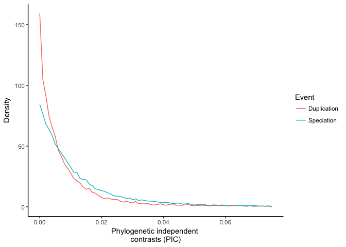
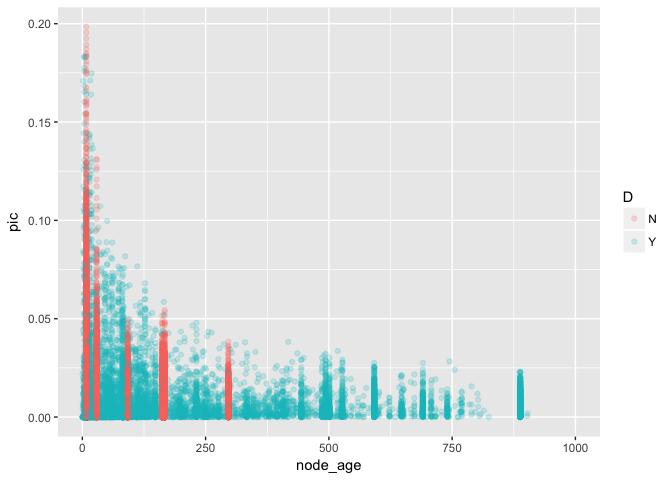

Introduction
------------

Here we reconsider two recent comparative analyses of gene expression data<sup>1,2</sup>.

KMRR Reanalysis
---------------

``` r
    library( treeio )
    library( tidyverse )
    library( magrittr )
    library( stringr )
    library( parallel )
    library( ggtree )
    library( ape )
    library( digest )
    library( hutan )

    # Set system computational parameters
    cores = detectCores() - 1
    if ( cores < 1 ) {
        cores = 1
    }
    set.seed( 23456 )
    
    # Set biology starting parameters, including files

    gene_tree_name = "Compara.75.protein.nhx.emf"
    
    kmrr_directory = "kmrr/"
    
    expression_file_names = c(
        "ChickenBrawandTScomparisonTable_9_6chPC.txt", 
        "ChimpBrawandTScomparisonTable_9_6cmPC.txt", 
        "GorillaBrawandTScomparisonTable_9_6gPC.txt", 
        "HumBrawandTScomparisonTable_9_6hPC.txt", 
        "MacacaBrawandTScomparisonTable_9_6mcPC.txt", 
        "MusBrawandTScomparisonTable_9_6mPC.txt", 
        "OpossumBrawandTScomparisonTable_9_6oPC.txt", 
        "PlatypusBrawandTScomparisonTable_9_6pPC.txt"
    )
    
    expression_file_names %<>% paste(kmrr_directory, ., sep="")
    
    gene_tree_name %<>% paste(kmrr_directory, ., sep="")
    
    
    # These are from the KRR code
    calibration_times = data.frame(
        age.min =
            c(20, 92, 167, 8, 42, 74, 296, 535, 104, 937, 29, 722, 441, 65, 15, 1215, 
                414, 371, 162, 25, 74, 77, 86), 
        clade = c("Hominoidea", "Euarchontoglires", "Mammalia", "Homininae", 
                            "Simiiformes", "Primates", "Amniota", "Vertebrata", "Eutheria", 
                            "Bilateria", "Catarrhini", "Chordata", "Euteleostomi", 
                            "Haplorrhini", "Hominidae", "Opisthokonta", "Sarcopterygii", 
                            "Tetrapoda", "Theria", "Murinae", "Sciurognathi", "Rodentia", "Glires"),
        stringsAsFactors=FALSE
    )
    
    
    
    # Functions
    
    # Returns a logical vector indicating which rows in nhx_tags are for tips
    is.tip.nhx = function( nhx ) {
      is.tip = rep( FALSE, nrow( nhx@data ) )
      is.tip[ 1:length( nhx@phylo$tip.label ) ] = TRUE
      is.tip
    }
    
    # put node ages in @data
    store_node_age = function( nhx ) {
  
      if ( class( nhx ) != "treedata" ) {
        return( nhx )
      }
      
      node_age = hutan::distance_from_tip( nhx@phylo )
      
      # make sure the dataframe is ordered by consecutive nodes
      stopifnot( all( nhx@data$node == 1:length( nhx@data$node ) ) )
      
      nhx@data$node_age = node_age 
      
      return( nhx )
    }
    
    # Make tree ultrametric, calibrating speciation nodes to consistent times
    calibrate_tree = function ( nhx, calibration_times ) {
            
            # Create calibration matrix for speciation nodes
            calibration = 
                nhx@data[ !is.tip.nhx( nhx ) ,  ] %>%
                filter( D=="N" ) %>%
                left_join( calibration_times, c( "label" = "clade" ) ) %>%
                select( node, age.min ) %>%
                mutate( age.max = age.min ) %>% 
                mutate( soft.bounds = NA )
            
            tree = try( ape::chronos( nhx@phylo, calibration=calibration, model="correlated" ) )
            if( "phylo" %in% class(tree) ){
                class( tree ) = "phylo"
                nhx@phylo = tree
                return( nhx )
            }
            else{
                return( NA )
            }
        }
```

``` r
    expression = lapply(
        expression_file_names, read.table, stringsAsFactors=FALSE, header=TRUE
    ) %>%
    bind_rows()
```

``` r
    lines = readLines( gene_tree_name )

    # Only consider the lines with trees
    lines = lines[ grepl( "^\\(", lines, perl = TRUE ) ]

    gene_trees = mclapply(
        lines,
        function( x ){
            tree_tc = textConnection( x )
            tree <- treeio::read.nhx( tree_tc )
            tree@data$label = c( tree@phylo$tip.label, tree@phylo$node.label )
            return( tree )
        }, mc.cores=cores
    )
```

There were 21124 parsed.

``` r
    gene_trees_annotated = mclapply(
        gene_trees,
        function( tree ){
            tree@data %<>% left_join( expression, by = c("G" = "Ensembl.Gene.ID") )
            return( tree )
        }, mc.cores=cores
    )
```

``` r
    drop_empty_tips = function( nhx ) {
      to_drop = which( is.na( nhx@data[ 1:length(nhx@phylo$tip.label), ]$Tau ) )
      remaining = length(nhx@phylo$tip.label) - length(to_drop)
      
      if( remaining > 3 ){
        pruned = treeio::drop.tip( nhx, to_drop )
        return( pruned )
      }
      else{
        return( NA )
      }
    }

    gene_trees_sub = mclapply( gene_trees_annotated, drop_empty_tips, mc.cores=cores )
    gene_trees_sub = gene_trees_sub[ ! is.na( gene_trees_sub ) ]
#   gene_trees_sub = gene_trees_sub[ lapply(gene_trees_sub, class) == "treedata" ]
    
    
    
    gene_trees_calibrated = mclapply( 
        gene_trees_sub,
        calibrate_tree, 
        calibration_times=calibration_times,
        mc.cores=cores
    )
    
    gene_trees_calibrated = gene_trees_calibrated[ ! is.na( gene_trees_calibrated ) ]
    
    gene_trees_calibrated = mclapply( gene_trees_calibrated, store_node_age, mc.cores=cores )
```

8947 trees passed taxon sampling criteria.

3739 were time calibrated.

``` r
    pic.nhx = function( nhx ) {
  
      p = pic( nhx@data$Tau[ is.tip.nhx( nhx ) ], nhx@phylo, var.contrasts=TRUE )
      
      nhx@data$pic = c( rep( NA, length( nhx@phylo$tip.label ) ), p[ ,1 ] )
      nhx@data$var_exp = c( rep( NA, length( nhx@phylo$tip.label ) ), p[ ,2 ] )
      
      return( nhx )
    }

    gene_trees_pic = mclapply( gene_trees_calibrated,  pic.nhx, mc.cores=cores )
    
    all_nodes = lapply( 
          gene_trees_pic, 
            function( nhx ){
                tags = nhx@data
                tags$gene = digest( nhx )
                tags %<>% select( -(B) ) # B has inconsistent types, remove it
                return(tags)
            }
        ) %>%
        bind_rows()
```

``` r
    nodes_contrast = 
        all_nodes %>%
        filter( ! is.na(pic) ) %>%
        mutate( pic=abs(pic) ) %>%
        filter( ! is.na(D) )

    nodes_contrast %>%
        ggplot( aes( x=pic, y=..density.., col=D ) ) + 
        geom_freqpoly( binwidth=.001, position="identity" ) +
        xlab("Phylogenetic independent \ncontrasts (PIC)") +
                xlim(0,0.075)
```



``` r
    nodes_contrast %>%
        filter( pic < 0.2 ) %>%
        ggplot( aes( x=node_age, y=pic, col=D ) ) +
        geom_point( alpha=0.2) +
        xlim(0,1000)
```



``` r
    wilcox.test( nodes_contrast %>% filter(D=="Y") %>% .$pic, nodes_contrast %>% filter(D=="N") %>% .$pic, alternative="greater" )
```

    ## 
    ##  Wilcoxon rank sum test with continuity correction
    ## 
    ## data:  nodes_contrast %>% filter(D == "Y") %>% .$pic and nodes_contrast %>% filter(D == "N") %>% .$pic
    ## W = 119770000, p-value = 1
    ## alternative hypothesis: true location shift is greater than 0

There were 9581 duplication nodes and 31123 speciation nodes.

``` r
    get_pairwise_summary = function ( nhx ) {
        
        # Create a tibble with one row for each pairwise combination of tip nodes
        ntips = length( nhx@phylo$tip.label )
        D = 1:ntips %>% combn( 2 ) %>% t() %>% as_tibble()
        names( D ) = c( "tip_a", "tip_b" )
        
        # Add a colmn with the gene tree hash 
        D %<>% mutate( gene_tree = digest( nhx ) )
        
        # Calculate the phenotypic difference between the tips
        D$difference = 
            apply(
                D,
                1,
                function(y) {
                    tau_values = nhx@data$Tau[ c( as.integer(y['tip_a']), as.integer( y['tip_b'] ) ) ]
                    max( tau_values ) - min( tau_values )
                }
            )
        
        # For each row, bet the most recent common ancestor of the pairwise tip combination
        D$mrca = 
            apply(
                D, 
                1, 
                function(y) ape::getMRCA( 
                    nhx@phylo, 
                    c( as.integer(y['tip_a']), as.integer(y['tip_b'] ))
                )
            ) %>%
            as.integer()
        
        # Merge data on this mrca to the node
        D %<>% left_join(
            nhx@data %>%
                select( D, node, node_age, pic ),
            by = c( "mrca" = "node")
                
        )
        
        # Calculate the distance between the tips, which for an ultrametric tree 
        # is twice the age of their most recent common ancestor
        D %<>% mutate( distance = 2 * node_age )
        
        return( D )
        
    }

    # Build a tibble of all pairwise comparisons between tips
    pairwise_summary = 
        mclapply( gene_trees_pic, get_pairwise_summary, mc.cores=cores ) %>% 
        bind_rows()
    
    
    pairwise_summary %>% 
        filter( ! is.na(D) ) %>%
    ggplot(aes(x=distance, y=difference, color=D)) + 
        geom_point(alpha=0.1) +
        geom_smooth(method=lm, se=FALSE) +
            xlim( 0, 2000 )
```


Levin *et al.* reanalysis
-------------------------

How changes in animal development relate to the evolution of animal diversity is a major question in evolutionary developmental biology (EvoDevo). To address this topic, Levin *et al.* <sup>1</sup> analyzed gene expression through the course of embryonic development for ten animal species, each from a different phylum. As their title ("The mid-developmental transition and the evolution of animal body plans") indicates, they arrived at two major conclusions. First, animal development is characterized by a well-defined mid-developmental transition. Second, this transition helps explain the evolution of features observed among distantly related animals. Specifically, they concluded that animals from different phyla exhibit an "inverse hourglass" model for the evolution of gene expression, where there is more evolutionary variance in gene expression at a mid phase of development than there is at early and late phases. Closely related animals have previously been described as having an hourglass model of gene expression, where evolutionary variance in expression is greater early and late in development than at the midpoint of development <sup>2,3</sup>. Levin *et al.* conclude that this contrast between distantly and closely related animals provides biological justification for the concept of phyla and may provide a long-sought operational definition of phyla. We previously described some concerns with their interpretations of these results <sup>4</sup>. Here we directly address problems with the analyses behind their evolutionary conclusions. Rather than support the inverse hourglass as a general pattern among distantly related species, our reanalyses of Levin *et al.* <sup>1</sup> indicate their existing data support the opposite conclusion - that the inverse hourglass is due to large differences specific to a single lineage, the ctenophore (comb jelly). Better understanding these differences will be of interest to future work, especially in light of current uncertainty regarding the phylogenetic placement of ctenophores and their unique biology <sup>5,6</sup>.

To understand our concerns with their analyses, it is helpful to first outline Levin *et al.*'s published methods and results. Although there are mature methods and tools for statistical analysis of character evolution <sup>7</sup> and gene expression <sup>8</sup>, Levin *et al.* <sup>1</sup> drew on neither of these very active areas of research and instead applied an *ad hoc* pairwise comparison of orthologous gene expression between species. They characterized each gene in each species as having expression that peaks in early, mid, or late temporal phase of development while the goodness of fit to these patterns was not considered, and alternative patterns were not evaluated. For each species pair, they then identified the orthologs shared by these species (shared orthologs vary from pair to pair). They then calculated a similarity score for each temporal phase for each species pair based on the fraction of genes that exhibited the same patterns in each species. The distributions of similarity scores are plotted in their [Figure 4d](http://www.nature.com/nature/journal/v531/n7596/fig_tab/nature16994_F4.html), and their Kolmogorov–Smirnov (KS) tests indicated that the early distribution and late distribution were each significantly different from mid distribution (P &lt; 10<sup>-6</sup> and P &lt; 10<sup>-12</sup>, respectively). This is the support they presented for the inverse hourglass model.

We began by examining the matrix of pairwise comparisons that their KS tests and Figure 4d are based on. As this figure shows (regenerated here as our Figure 1a), there is not a strong distinction between these temporal phases - the distributions for the early, mid, and late distributions overlap considerably. The medians are close in value, and the range of mid phase includes the entire range of the early phase. Further inspection (Figure 1a) reveals that the mid phase distribution has several outliers with very low similarity scores. We found that all five of the lowest values in the mid phase distribution are for pairwise comparisons that include the ctenophore (Figure 1a). When the nine pairwise comparisons that include the ctenophore are removed, the differences between the early and mid phase distributions are greatly reduced (Figure 1b).

We also found several problems with the statistical tests that were used to evaluate the inverse hourglass hypothesis. First, in the published analyses every data point was included twice because both reciprocal comparisons (which have the same values) were retained. For example, there is both a nematode to arthropod comparison and an arthropod to nematode comparison. As a consequence, there are 90 entries for the 45 pairwise comparisons, and by doubling the data the significance of the result appears much stronger than it actually is. After removing the duplicate values, the p values are far less significant, 0.002 for the early-mid comparison and on the order of 10<sup>-6</sup> for early-late. Second, the test they used (KS test) is not appropriate for the hypothesis they seek to evaluate. The KS test does not just evaluate whether one distribution is greater than the other, it also tests whether the shape of the distributions are the same. In addition, the samples in this dataset are matched (*i.e.*, for each pairwise comparison there is a early, mid, and late expression value), which the KS test does not take into account. The Wilcoxon test is instead appropriate in this case. After removing the duplicate scores, removing the ctenophore, and applying the Wilcoxon test, there is no significant difference between the early phase and mid phase distributions (P = 0.1428 for the early-mid comparison and P &lt; 10<sup>-5</sup> for the late-mid comparison), and the inverse hourglass turns into a wine bottle (Figure 1b).

Our results highlight the importance of explicitly accounting for phylogenetic relationships when studying character evolution, including developmental <sup>9</sup> and functional genomic traits <sup>10</sup>. This is particularly true for evolutionary analyses of quantitative gene expression <sup>11</sup>. Pairwise comparisons result in the same evolutionary changes being counted multiple times in each species pair, as for the ctenophore comparisons that were mistaken for a global pattern here. This is a well understood property of pairwise comparisons that has been specifically addressed by phylogenetic comparative methods <sup>12</sup>. This particular case illustrates the shortcomings of *ad hoc* rank-based methods <sup>3</sup> and pairwise comparisons <sup>1</sup> for the study of the evolution of gene expression. Phylogenetic analyses of character evolution provide not only a way to avoid these problems, but a richer context for interpreting the biological implications of the results.


> Figure 1 | Distributions of pairwise similarity scores for each phase of development. Pairwise scores for the ctenophore are red. Wilcoxon test p-values for the significance of the differences between early-mid distributions and late-mid distributions are on the right. Model of variance, which is inversely related to similarity, is on the left. (a) The distributions as published. Low similarity (*i.e.*, high variance) in the mid phase of development was interpreted as support for an inverse hourglass model for the evolution of gene expression. The five least-similar mid phase scores were all from the ctenophore. Published KS p-values, based on duplicated data, are in parentheses. The inset ctenophore image is by S. Haddock from phylopic.org. (b) The distributions after the exclusion of the ctenophore. The early and mid phase distributions are not statistically distinct. This suggest a wine bottle model, with similar evolutionary variance at the early and mid phase and less at the late phase.

Methods
-------

### KMRR reanalysis

Based on their scripts from: <https://figshare.com/articles/Tissue-specificity_of_gene_expression_diverges_slowly_between_orthologs_and_rapidly_between_paralogs/3493010/2>

To replciate the published analysis, `cd` to `Data_used/Expression_data`, launch `R`, and run:

    source( "../Rscript.R" )

After running the analysis above, also obtain the `Compara.75.protein.nh.emf` gene trees from <ftp://ftp.ensembl.org/pub/release-75/emf/ensembl-compara/homologies/> and place them in the same directory as this file.

### Levin et al. reanalysis

Levin *et al.* helpfully provided data and clarification on methods. We obtained the matrix of pairwise scores that underlies their [Figure 4d](http://www.nature.com/nature/journal/v531/n7596/fig_tab/nature16994_F4.html) and confirmed we could reproduce their published results. We then removed duplicate rows, identified ctenophores as overrepresented among the low outliers in the mid-developmental transition column, and applied the Wilcoxon test in place of the Kolmogorov-Smirnov test. These data, our analysis code, and additional information are available in a git repository at <https://github.com/caseywdunn/levin2016>. This repository includes our analysis notebook at <https://rawgit.com/caseywdunn/levin2016/master/reanalyses.html>.

Ackowledgements
---------------

References
----------

1. Kryuchkova-Mostacci, N. & Robinson-Rechavi, M. Tissue-Specificity of Gene Expression Diverges Slowly between Orthologs, and Rapidly between Paralogs. *PLoS Computational Biology* **12,** e1005274–13 (2016).

2. Levin, M. *et al.* The mid-developmental transition and the evolution of animal body plans. *Nature* **531,** 637–641 (2016).
