Multiple pairwise comparisons between species strongly mislead functional genomics studies
==========================================================================================

Casey W. Dunn1\*, Felipe Zapata1,2, Catriona Munro1, Stefan Siebert1,3, Andreas Hejnol4

1 Department of Ecology and Evolutionary Biology, Brown University, Providence, RI, USA

2 Current address: Department of Ecology and Evolutionary Biology, University of California Los Angeles, Los Angeles, CA, USA

3 Current address: Department of Molecular & Cellular Biology, University of California at Davis, Davis, CA, USA

4 Sars International Centre for Marine Molecular Biology, University of Bergen, Bergen, Norway

\* Corresponding author, <casey_dunn@brown.edu>

Abstract
--------

Functional genomics, the study of how genomes work, is one of the most rapidly advancing fields in biology. There is now considerable interest in comparing genome function across species to understand what is conserved, what is variable, and how the diversity of organism traits (including anatomy, physiology, and development) relates to genome diversity. Most published comparisons of genome function across species have relied on multiple pairwise comparisons between species, an approach that neglects to account for the evolutionary relationships among species. This has two potential negative impacts. First, it can lead to the wrong conclusions about the evolution of genome function. Second, it is a missed opportunity to learn about biology that can only be understood in an explicit historical context that considers these relationships. Here we examine two recently published comparative gene expression studies that used multiple pairwise comparisons rather than phylogenetic approaches to investigate evolutionary patterns of gene expression. We find problems with the pairwise comparisons used in both studies that undermine their published conclusions. The first study we examine found that expression tends to be more different between paralogs than orthologs, and interpreted this as evidence of the ortholog conjecture- the hypothesis that there are greater rates of evolutionary change following duplication. Our phylogenetic analysis finds no difference in rates following duplication and speciation. Instead, the greater difference between paralogs is because they tend to be more distantly related to each other than orthologs are to each other. The second study claimed to find more evolutionary variance in gene expression at a midpoint of embryonic development than earlier and later when comparing distantly related animals. We instead find that changes along the branch of a single taxon, the ctenophore, were over counted because they were included in each pairwise comparison with this species. These reanalyses are concrete demonstrations of the inadequacy of pairwise comparisons in comparative genomics studies, including gene expression analyses, and indicates that it will be critical to adopt phylogenetic comparative methods in future work.

Introduction
------------

The focus of genomics research has quickly shifted from describing genome sequences to functional genomics, the study of how genomes "work" using tools that measure functional attributes such as expression, chromatin state, and transcription initiation. Functional genomics, in turn, is now becoming more comparative- there is great interest in understanding how functional genomic variation across species gives rise to a diversity of development, morphology, physiology, and other phenotypes1. Comparative Functional Genomics (CFG) analyses are also critical to transferring functional insight across species, and will grow in importance in coming years.

A rich theoretical and statistical methodology of phylogenetic comparative methods have been developed over the last three decades to address the challenges and opportunities of comparisons across species2–7. A central challenge is the dependence of observations across species due to the evolutionary history of species -- more closely related species share many traits that evolve once in a common ancestor. This violates the fundamental assumption of independence of observations in standard statistical methods. Phylogenetic comparative methods have largely been applied to the evolution of morphological and ecological traits, but are just as relevant to CFG. Most CFG studies have abstained from phylogenetic approaches and instead heavily rely on multiple pairwise comparisons (Fig. 1A) between contemporary traits that do not account for the fact that evolutionary relationships explain much of the structure of variation across species. This leaves CFG studies susceptible to serious statistical errors and is a missed opportunity to ask questions that are only accessible in an explicit phylogenetic context.

One reason that CFG has not yet embraced phylogenetic approaches is that it has not yet been concretely demonstrated that pairwise and phylogenetic approaches can lead to different results in CFG studies. In this manuscript we examine this issue. Although the value of phylogenetic approaches has been repeatedly shown in comparative analyses of other types of character data8–10, this value is apparently not well known to the functional genomics community since the field has until recently largely focused on within-species analyses. Many initial CFG studies have also been focused on only two species at a time, where the differences between phylogenetic and pairwise approaches are not as pronounced. As the number of species considered in each CFG study grows, the shortcomings of pairwise approaches will become far more acute.

Most CFG studies to date compare gene expression across species, often between distinct tissues or developmental time points. Gene expression has been a popular target of CFG studies because, with the advent of RNA-Seq and related transcriptome sequencing methods, it is the most readily collected functional genomics trait across diverse species. Here we reconsider two recent comparative analyses of gene expression data11,12.

The first study, Kryuchkova-Mostacci and Robinson-Rechavi (KMRR) 201611, analyzed multiple vertebrate expression datasets to test the ortholog conjecture - the hypothesis that orthologs tend to have more conserved attributes (specificity of expression across organs in this case) than do paralogs13. Using pairwise comparisons (Fig. 1A), they found lower expression correlation between paralogs than between orthologs and interpreted this as strong support for the ortholog conjecture.

The second CFG study we evaluate here is Levin *et al.*12. This study analyzed gene expression through the course of embryonic development for ten animal species, each from a different phylum. Using pairwise comparisons (Figure 1A), they found there is more evolutionary variance in gene expression at a mid phase of development than there is at early and late phases for these ten animals (Fig. XX). They suggest that this supports an "inverse hourglass" model for the evolution of gene expression, in contrast with the "hourglass" model previously proposed for closely related species15, and provides biological justification for the concept of phyla and may provide an operational definition of phyla. We previously described concerns with these interpretations16. Here we directly address the analyses themselves by examining the structure of the pairwise comparisons.

> Figure 1 | Pairwise and phylogenetic comparative approaches. (a) Many comparative functional genomic studies rely on pairwise comparisons, where traits of each gene are compared to traits of other genes (such as orthologs and paralogs). This leads to many more comparisons than unique observations, making each comparison dependent on others. (b) Comparative phylogenetic methods, including phylogenetic independent contrasts2, make a smaller number of independent comparisons, where each contrast measures independent changes along different branches. Phylogenetic approaches are rarely used for functional genomics studies.

Results and Discussion
----------------------

### KMRR Reanalysis

#### Original pairwise test of the ortholog conjecture

The KMRR study11 sought to test the ortholog conjecture. The ortholog conjecture13 is the proposition that orthologs (genes that diverged from each other due to a speciation event) have more similar attributes than do paralogs (genes that diverged from each other due to a gene duplication event). The ortholog conjecture has important biological and technical implications. It shapes our understanding of the functional diversity of gene families. It is used to relate findings from well-studied genes to related genes that have not been investigated in detail. It can be applied to any trait of genes, from gene sequence to biochemical properties to expression. While the ortholog conjecture describes a specific pattern of functional diversity across genes, it is also articulated as a hypothesis about the process of evolution-- that there is greater evolutionary change in gene attributes following a duplication event than a speciation event.

Despite its importance, there have been relatively few tests of the ortholog conjecture. Previous work has shown that ontology annotations are not sufficient to test the ortholog conjecture17,18. Analyses of domain structure were consistent with the ortholog conjecture19. There have been few tests of the ortholog conjecture with regards to gene expression17, and KMRR is the most thorough such expression study to date.

The KMRR study considered several publicly available datasets. Here we consider their conclusions in the context of one of these studies, Brawand *et al.* 201120. This dataset of gene expression for six organs across ten species (nine mammals and one bird), eight of which were analyzed by KMRR, is the best sampled in their analyses. Their expression summary statistic is Tau21, an indicator of tissue specificity of gene expression. It can range from a value of 0, which indicates no specificity (*i.e.*, uniform expression across tissues), to a value of 1, which indicates high specificity (*i.e.*, expression in only one tissue). It is convenient in that it is a single number of defined range for each gene, though of course since the original expression is multidimensional this means much information is discarded. This includes information about which tissue expression is specific to. For example, if one gene has expression specific to the brain and another expression specific to the kidney, both would have a Tau of 1.

Results in KMRR are based on pairwise comparisons (Figure 1A) between Tau within each gene family. They found the correlation coefficient of Tau for orthologs to be significantly greater than the correlation coefficient of Tau for paralogs, *i.e.* that orthologs tend to be more similar to each other than paralogs. From this they concluded that their analyses support the ortholog conjecture. They also concluded that this pattern provides support for a particular evolutionary process, that "tissue-specificity evolves very slowly in the absence of duplication, while immediately after duplication the new gene copy differs".

#### Phylogenetic reanalyses

We reanalyzed the the KMRR study using phylogenetic comparative methods, focusing on the dataset of Brawand *et al.* 201120. For each internal node in each gene tree (Figure 1b), we measured the phylogenetic independent contrast (PIC)2 of the expression statistic Tau. This is the difference in values of Tau for descendant nodes scaled by the expected variance (determined largely by the lengths of these branches). These contrasts were then annotated by whether they are made across a speciation or duplication event. The original description of independent contrasts2 focused on assessing covariance between changes in two traits on a tree. Our use of contrasts is a bit different-- we look for differences in evolutionary changes of one trait (differential expression) between two categories of nodes (speciation and duplication) on a tree.

> Figure XXExpectations | (a) Under the null hypothesis that there is no difference in the rate of evolution after duplication or speciation events, the distribution of PICs would be the same across both types of nodes. (b) Under the ortholog conjecture, contrasts across duplication nodes would tend to be larger than contrasts across speciation nodes.

To test the ortholog conjecture it is essential to have a null hypothesis that makes predictions distinct from the ortholog conjecture. A suitable null hypothesis is that there is no difference in evolutionary change in differential expression along branches that descend from speciation or duplication events23 (Figure 1b). Under this hypothesis, we would predict that contrasts across speciation nodes and duplication nodes are drawn from the same distribution (Figure XXEXPECTATIONS a). Under the alternative hypothesis specified by the ortholog conjecture, that there is a higher rate of change following duplication events than speciation events, we would expect to see the distribution of duplication contrasts shifted to higher values relative to the speciation contrasts (Figure XXEXPECTATIONS b).

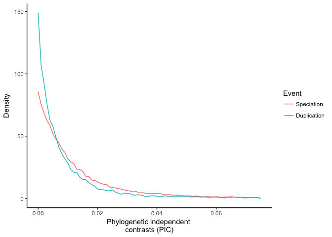

> Figure XXKMRR | Density plot of the magnitude of phylogenetic independent contrast values following duplication and speciation events. These contrasts are not larger following duplication events, as predicted by the ortholog conjecture.

When we reanalyze the data with phylogenetic independent contrasts, we did not find increased evolutionary change in expression following duplication events (Fig. XXKMRR). Of the 21124 trees that were parsed from ENSMBL Compara24, 8859 passed taxon sampling criteria (4 genes) after removing tips without Tau values and had at least one speciation event. Of these, 4763 were successfully time calibrated. These calibrated pruned trees were used to calculate phylogenetic independent contrasts for Tau. They contain 12856 duplication nodes and 43587 speciation nodes.

Given the ortholog conjecture, we would expect to see larger contrasts following duplication events than speciation events. Instead, we find no such distribution (Figure XXKMRR). The Wilcoxon rank test does not reject the null hypothesis that the rate of evolution following duplications is the same as or less than the rate following speciation (p value = 1). Our results therefore find no evidence for the ortholog conjecture in this system.

We next examined the possibility that ascertainment biases were differentially impacting the inference of evolution following duplication and speciation events. We focused on two possible sources of bias - node depth and branch length. We found no evidence that either affected our results (Supplementary Materials). We also examined the sensitivity of the results to the calibration times used for speciation events on the gene trees. This is important because it is expected that genes from separate species trace backward in time to a common ancestor at older times than the splitting times of the species to which they belong25,26. There is also uncertainty associated with the timing of these speciation events. In replicate analyses we added random noise to the calibration times and found that it does not impact our inability to reject the null hypothesis (Supplementary Materials).

#### Understanding the incongruence between pairwise and phylogenetic methods

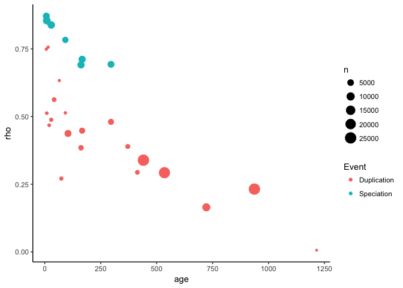

> Figure XX\_KMRR\_Pairwise | This figures demonstrates that the pairwise analyses presented in Figure 2a of KMRR can be reproduced with the subset of data we consider here and our own independent code base. Each circle indicates the Tau Pearson correlation (rho) for a set of pairwise comparisons annotated with a specific node name of a given age and event type, *i.e.*, whether the divergence at that nodes was due to speciation (giving rise to orthologs) or duplication (giving rise to paralogs). Following KMRR Figure 2a, this figure shows only the comparisons that include a human sequence.

In order to better understand why our phylogenetic analysis supports a different conclusion (*i.e.*, no support for the ortholog conjecture) than the published analysis of KMRR11 (*i.e.*, strong support for the ortholog conjecture), we first checked to make sure we could reproduce their result based on pairwise analyses. This is important since we are only looking at at a subset of the data they considered, the Brawand *et al.* 201120 dataset for gene trees that could be successfully time calibrated. We can replicate their result - we find a higher Tau correlation between orthologs (R=0.766) than between paralogs (R=0.401).

Why is it that pairwise methods and phylogenetic methods lead to opposite conclusions? The reason is that they describe different things. Pairwise comparisons describe contemporary patterns, while phylogenetic methods infer historical processes10. There need not be a different process of evolution following speciation and duplication for paralogs to be more different than orthologs. This could be due to the structure of the gene phylogenies. If paralogs tend to be more distantly related to each other than orthologs, then there would be more time for differences to accumulate even if the rate of change is the same between the two. This is, in fact, the case for these data. While the mean distance between orthologs is 305.3 My, the mean distance between paralogs is 1539.7 My. As described above, this is because the oldest speciation event is by definition the most recent common ancestor of the species included in the study, but many gene families underwent duplication before this time.

To test the hypothesis that distantly related paralogs arising from these older duplication events (Supplementary Figure XXAscertainment a) are the reason for the lower correlation of Tau between paralogs than between orthologs, we removed them. When we consider only the paralogs that arise from duplication events the same age or younger than the oldest speciation event (Supplementary Figure XXAscertainment b), the observed pattern is very different. The correlation of Tau between these shallower paralog pairs, R=0.673, is much stronger than for the correlation between all paralog pairs, R=0.401. This is much closer to the ortholog correlation, which has R=0.766.

The reason that paralog pairs have Tau values that are more different than ortholog pairs is that they tend to be more distantly related, not because there are different rates of Tau evolution following duplication and speciation events. This means that having information on whether two genes are orthologs or paralogs provides little added information about expression beyond knowing how distantly related the two genes are. This has several implications. It is an example of the limitations of the concepts of orthology and paralogy27. These terms can have straightforward meaning in small gene trees with simple duplication/speciation histories, but the utility of the terms breaks down on larger more complex gene trees. Orthology and paralogy are annotations on the tips of the tree that are derived from the inferred structure of the tree and history of duplication and speciation at internal tree nodes. In this sense, orthology and paralogy are statements about the internals of the tree that are distilled into statements at the tips of the tree. Much is lost in the process, though. These are the same pre-computed trees we use in our phylogenetic re-analyses of their study. For most questions it is much more direct to focus on the structure of the tree and the inferred processes within the tree, such as which internal nodes are duplication or speciation events and how much change occurs along the branches. In this case, KMRR11 relied on orthology and paralogy annotations that are derived from the inferred duplication and speciation history on gene phylogenies24.

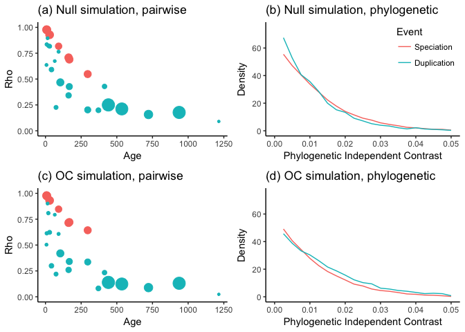

> Figure XXSim

We simulated a data set under the null model that tau evolves at the same rate following duplication and speciation events. Under the null model, pairwise analysis results (Figure XXSim a) are very similar as for the observed data, with higher rho for orthologs (0.7395087) than paralogs (0.2497975). In the phylogenetic analysis of the null simulation, contrasts show similar divergence following speciation and duplication (Figure XXSim b) and does not reject the null hypothesis (Wilcoxon p=0.9695727).

We next simulated a data set under the ortholog conjecture, where the rate of evolution of Tau following duplication was 2 fold the rate following speciation. The results of this heterogeneous model are nearly indistinguishable from the null model (Figure XXSim c), and also have a higher rho for orthologs (0.7770009) than paralogs (0.1774267). In the phylogenetic analysis of the ortholog conjecture simulation, contrasts XX (Figure XXSim c) and XX (Wilcoxon p=4.915621410^{-28}).

#### Implications for the ortholog conjecture

There has been considerable recent interest in, and controversy about, the ortholog conjecture13,14,23,28. Our results are consistent with multiple studies that have not found support for the ortholog conjecture13,23,29. Another study found only slightly greater similarity between orthologs than paralogs30.

Our reanalysis of KMRR using phylogenetic methods suggests that the ortholog conjecture is not a dominant pattern that is central to explaining the evolution of phenotypic diversity in gene families. This has important biological implications. It suggests that the mechanism of gene divergence (speciation versus duplication) may not have as strong an impact on phenotypic divergence as sometimes proposed. It also has technical implications. Rather than focus on whether genes are orthologs or paralogs when attempting to predict function, it may be more effective to simply focus on how closely related or distantly related they are. Closely related paralogs, for example, may tend to have more similar phenotypes than more distantly related orthologs23.

The ortholog conjecture does not have to be an all or nothing question. It may be the case that the rates of phenotypic evolution following duplication may be greater than that following duplication in some organisms, gene families, and evolutionary processes28. We just don't find evidence for it when summarizing gene expression across tissues with Tau in these mammals. This calls into question the general predictive power of the ortholog conjecture, and until these processes are better understood it will be necessary to test for it in each situation. These tests should be articulated in terms of clear alternative hypotheses23 that make distinct phylogenetic comparative predictions.

### Levin *et al.* reanalysis

#### Original pairwise analyses of developmental gene expression

> Figure XXLevin | Distributions of pairwise similarity scores for each phase of development. Pairwise scores for the ctenophore are red. Wilcoxon test p-values for the significance of the differences between early-mid distributions and late-mid distributions are on the right. Model of variance, which is inversely related to similarity, is on the left. (a) The distributions as published. Low similarity (*i.e.*, high variance) in the mid phase of development was interpreted as support for an inverse hourglass model for the evolution of gene expression. The five least-similar mid phase scores were all from the ctenophore. Published KS p-values, based on duplicated data, are in parentheses. The inset ctenophore image is by S. Haddock from phylopic.org. (b) The distributions after the exclusion of the ctenophore. The early and mid phase distributions are not statistically distinct. This suggest a wine bottle model, with similar evolutionary variance at the early and mid phase and less at the late phase.

How changes in animal development relate to the evolution of animal diversity is a major question in evolutionary developmental biology (EvoDevo). To address this topic, Levin *et al.*12 analyzed gene expression through the course of embryonic development for ten animal species, each from a different phylum. They arrived at two major conclusions. First, animal development is characterized by a well-defined mid-developmental transition that marks the transition from an early phase of gene expression to a late stage of gene expression. Second, this transition helps explain the evolution of features observed among distantly related animals. Specifically, they concluded that animals from different phyla exhibit an "inverse hourglass" model for the evolution of gene expression, where there is more evolutionary variance in gene expression at a mid phase of development than there is at early and late phases. Closely related animals have previously been described as having an hourglass model of gene expression, where evolutionary variance in expression is greater early and late in development than at the midpoint of development15,31. Levin *et al.* conclude that this contrast between distantly and closely related animals provides biological justification for the concept of phyla and may provide a definition of phyla.

Levin *et al.*12 arrived at this conclusion by making multiple pairwise comparisons of ortholog expression through development between each pair of species. For each species pair, they identified the orthologs shared by these species. This list of shared genes was different from species pair to species pair. They characterized each gene in each species as having expression that peaks in early, mid, or late temporal phase of development. They then calculated a similarity score for each temporal phase for each species pair based on the fraction of genes that exhibited the same patterns in each species. The distributions of similarity scores are plotted in their [Figure 4d](http://www.nature.com/nature/journal/v531/n7596/fig_tab/nature16994_F4.html), and their Kolmogorov–Smirnov (KS) tests indicated that the early distribution and late distribution were each significantly different from mid distribution (P &lt; 10-6 and P &lt; 10-12, respectively). This is the support they presented for the inverse hourglass model.

#### Reexamination of pairwise comparisons

We examined the matrix of pairwise comparisons used as the base for the KS tests and Figure 4d in *Levin et al.*12, and thus as evidence to support the "inverse hourglass model". We found several problems resulting from the use of multiple pairwise comparisons. First, we found that every data point was included twice because both reciprocal pairwise comparisons (which have the same values) were retained. For example, there is both a nematode to arthropod comparison and an arthropod to nematode comparison. As a consequence, there are 90 entries for the 45 pairwise comparisons, and by doubling the data the significance of the result appears stronger than it actually is. After removing the duplicate values, the p values are far less significant, 0.002 for the early-mid comparison and on the order of 10-6 for early-late. In addition, the test they used (KS test) is not appropriate for the hypothesis they seek to evaluate. The KS test does not just evaluate whether one distribution is greater than the other, it also tests whether the shape of the distributions are the same. In addition, the samples in this dataset are matched (*i.e.*, for each pairwise comparison there is a early, mid, and late expression value), which the KS test does not take into account. The Wilcoxon test is instead appropriate in this case. When applied to the de-duplicated data, the significance of this test is 0.02 for the early-mid comparison and on the order of 10-7 for early-late.

The next issue we found was that all five of the lowest values in the mid phase distribution (Figure XXLevin a) are for pairwise comparisons that include the ctenophore (comb jelly). When the nine pairwise comparisons that include the ctenophore are removed and the general statistical issues noted above are addressed, there is no significant difference between the early phase and mid phase distributions (P = 0.1428 for the early-mid comparison and P &lt; 10-5 for the late-mid comparison). The inverse hourglass turns into a bottle (Figure XXLevin b). This highlights a well understood property of pairwise comparisons across species2: evolutionary changes along a given branch, like those along the ctenophore branch, impact each of the multiple pairwise comparisons that includes that branch. The pairwise comparisons are therefore not independent - different pairwise comparisons are impacted by canges along some of the same branches (Figure 1a). This can give the impression of a general pattern across the tree that is instead specific to changes along one part of the tree. The number of comparisons impacted by each change depends on the structure of the phylogenetic tree, i.e. how the species are related to each other.

Phylogenetic comparative methods were developed specifically to address this problem2. While we do demonstrate this problem impacts the Levin et al. analysis, we did not perform a phylogenetic reanalysis of this study, as we did for the KMRR study. This is because the similarity metric computed in the pairwise comparisons of Levin et al. are based on different genes for different species pairs. This means that they do not generate a trait that can be evaluated across a phylogeny, as KMRR's Tau can be. A full phylogenetic reanalysis would be possible by using upstream analysis products to re-derive new expression summary statistics suitable for phylogenetic comparative methods.

In addition to the problems with the pairwise comparisons discussed above, we previously described several other concerns with the experimental design, analysis, and interpretation of the results of this study16. For instance, because Levin *et al.*12 only sampled one species per phylum, there is no way to tell if observed differences are unique to the branches that gave rise to clades designated as phyla or occurred along the many other branches in the tree. Moreover, the goodness of fit of each gene having expression peaking at three phases was not considered, and alternative patterns, such as the possibility that there are more phases of expression, were not evaluated.

### Phylogenetic comparative methods in functional genomics

Our results highlight the importance of explicitly accounting for phylogenetic relationships when studying character evolution, including developmental32 and functional genomic traits33. This is particularly true for evolutionary analyses of quantitative gene expression34.

Some of the most widely used phylogenetic comparative methods2,3 are already directly applicable to CFG data. There are interesting new challenges at this interdisciplinary interface that will need to be addressed to fully realize the potential of phylogenetic comparative functional genomics studies. One such challenge is that most phylogenetic comparative analyses of covariance between traits have been developed to address problems with many more species (e.g., dozens or more) relative to the number of traits being examined. In CFG analyses, there are often far fewer species because adding taxa is still expensive, but tens of thousands of traits. This creates statistical challenges as the resulting covariance matrices are singular and, if not treated appropriately, imply many false correlations that are artifacts of project design. We outlined these challenges and potential solutions in the context of gene expression34. In addition to methods development, there is a critical need for software tools that make it simpler to integrate existing functional genomic and phylogenetic comparative packages.

Recent advances in phylogenetic comparative methods are particularly well suited to addressing questions about the evolution of functional genomic traits. Most early phylogenetic comparative methods attempted to account for evolutionary signal to correct statistical tests for correlations between traits, while more recent methods tend to focus on testing hypotheses of evolutionary processes35. The application of this newer focus to functional genomics provides an exciting opportunity to address long standing questions of broad interest, including the order of changes in functional genomics traits and shifts in rates of evolution of one functional genomics trait following changes in another trait.

We are not the first to apply phylogenetic comparative methods to functional genomic data. While the vast majority of comparative functional genomics studies have used standard pairwise similarity methods, a small number of CFG studies have employed phylogenetic comparative approaches36–38. For instance, a phylogenetic ANOVA39 of the evolution of gene expression improves statistical power and drastically reduces the rate of false positives relative to pairwise approaches.

Addressing the statistical dependence of pairwise comparisons is not the only advantage of using phylogenetic comparative methods for functional genomics analyses. Another problem with the pairwise comparisons is that, except at the tips, they summarize changes along many branches in the phylogeny. Two paralogs that diverged from a duplication event deep in the tree may have many subsequent duplication and speciation events, and changes along all these branches will impact the final pairwise comparison. Phylogenetic methods have the advantage of isolating the changes under consideration (Fig. 1b). The phylogenetic methods avoid diluting the change that occurs along the branches that follow the node in question with changes along all subsequent branches. There may still be missing speciation events, due to extinction and incomplete taxon sampling, and missing duplication events, due to gene loss, but these omissions affect both methods.

Conclusions
-----------

The fact that the first two comparative functional genomics studies we reanalyzed show serious problems with pairwise comparisons indicates that there likely to be similar problems in other studies that use these methods, and that future comparative studies will be compromised if they continue to use pairwise methods. Studies of evolutionary functional genomics should not be focused on the tips of the tree, they should explicitly delve into the tree itself.

These analyses illustrate how important it is to not conflate evolutionary patterns with the processes that generated them. Finding a pattern wherein paralogs tend to be more different than orthologs is not evidence that there are different processes by which orthologs and paralogs evolve. This is also the expected pattern when they evolve under the same process but paralogs tend to be more distantly related to each other than orthologs are. The fact that multiple pairwise comparisons of developmental gene expression across diverse species share a particular pattern is not evidence of a general process that explains the differences between all species in the analysis. It is also the expected pattern when there are unique changes specific to a single species, as these changes will impact all pairwise comparisons to that species and therefore be counted multiple times. To use patterns across living species to test hypotheses about evolutionary processes, it is also necessary to incorporate information about evolutionary relationships, *i.e.* phylogenies. There have been decades of work on building comparative phylogenetic methods that do exactly that, and they are just as relevant to comparing functional genomics traits across species as they are to comparing morphology or any of the other traits they are already routinely applied to.

Methods
-------

All files needed to re-execute the analyses presented in this document are available at <https://github.com/caseywdunn/comparative_expression_2017>. The most recent commit at the time of the analysis presented here was cc606989973192aee96fe9ca0a3f357a6bacfe9a. See the `readme.md` file in this repository for more information on the contents of the source file and how to re-execute them.

### KMRR reanalysis

The KMRR study11 followed excellent practices in reproducibility. They posted all data and code needed to re-execute their analyses at figshare: <https://figshare.com/articles/Tissue-specificity_of_gene_expression_diverges_slowly_between_orthologs_and_rapidly_between_paralogs/3493010/2> . We slightly altered their `Rscript.R` to simplify file paths and specify one missing variable. This modified script and their data files are available in the github repository for this paper, as are the intermediate files that were generated by their analysis script that we used in our own analyses. We also obtained the `Compara.75.protein.nh.emf` gene trees24 from <ftp://ftp.ensembl.org/pub/release-75/emf/ensembl-compara/homologies/> and place them in the same directory as this file. These gene trees include branch lengths and annotate each internal node as being a duplication or speciation event.

We considered only the data from Brawand *et al.* 201120 for the eight taxa included in KMRR. We left in sex chromosome genes and testes expression data, which KMRR removed in some of their sensitivity analyses. This corresponded to the analyses that provided the strongest support for the ortholog conjecture and therefore the most conservative reconsideration of it.

After parsing the trees from the Compara file with treeio, which was recently split from ggtree40, we added Tau estimates generated by the KMRR `Rscript.R` to the tree data objects. We then pruned away tips without expression data, retaining only the trees with 4 or more tips. We also only retained trees with one or more speciation events, as speciation events are required for calibration steps. This removes trees that have multiple genes from only one species after pruning away tips without expression data.

The gene trees were then time calibrated. The goal is not necessarily to have precise dates for each node, but to scale branch lengths so that they are equivalent across the trees. This in turn scales the phylogenetic independent contrasts (which take branch length into account) so they can be compared appropriately. We found a problem with the clade names on the ENSEMBL Compara trees, which others have also identified41, that first had to be fixed. Hominini is the name for the clade that includes humans and chimps, while Homininae is the clade that includes humans, chimps, and gorillas. Both clades are labeled as Homininae in the Compara trees, though, which would interfere with calibration of these nodes. To fix the problem, we identified all clades labeled Homininae that have no gorilla sequence and renamed them Hominini. We then calibrated the trees by fixing the speciation nodes to the dates specified in the KMRR code, with the exception of Hominini and Homininae. These we set to 7 million years and 9 million years, drawing on the same TimeTree source42 that KMRR used. We used the `chronos()` function from the R package ape43 for this calibration, with the `correlated` model. See Supplementary Materials for additional sensitivity analyses to time calibration. Some trees could not be calibrated with these hard node constraints, and were discarded.

For each node in the remaining calibrated trees, we calculated the phylogenetic independent contrast for Tau across its daughter branches with the `pic()` function in ape43. We then collected the contrasts from all trees into a single table, along with otherr annotations including whether the node is a speciation or duplication event. This table, `nodes_contrast`, was then analyzed as described in the main text for the presented plots and tests.

### Levin et al. reanalysis

Levin *et al.* helpfully provided data and clarification on methods. We obtained the matrix of pairwise scores that underlies their [Figure 4d](http://www.nature.com/nature/journal/v531/n7596/fig_tab/nature16994_F4.html) and confirmed we could reproduce their published results. We then removed duplicate rows, applied the Wilcoxon test in place of the Kolmogorov-Smirnov test, and identified ctenophores as overrepresented among the low outliers in the mid-developmental transition column. An annotated explanation of these analyses is included in the git repository at

Acknowledgments
---------------

Thanks to XX. This work was supported by the National Science Foundation (DEB-1256695 and the Waterman Award).

Supplementary Material
----------------------

### KMRR Analyses

#### Summary statistics

| Clade            |     N|
|:-----------------|-----:|
| Hominini         |  5760|
| Homininae        |  8297|
| Catarrhini       |  7413|
| Euarchontoglires |  4096|
| Theria           |  6158|
| Mammalia         |  6038|
| Amniota          |  5825|

| Species                  |     N|
|:-------------------------|-----:|
| gallus gallus            |  7056|
| gorilla gorilla          |  8266|
| homo sapiens             |  8549|
| macaca mulatta           |  9162|
| monodelphis domestica    |  8254|
| mus musculus             |  8733|
| ornithorhynchus anatinus |  9637|
| pan troglodytes          |  7983|

    ## [[1]]

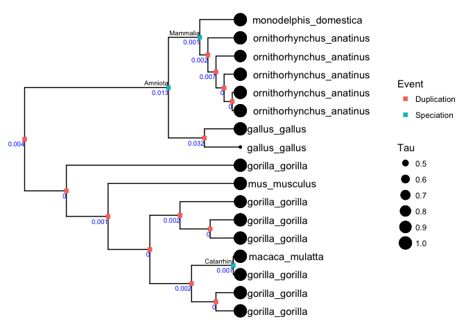

    ## 
    ## [[2]]

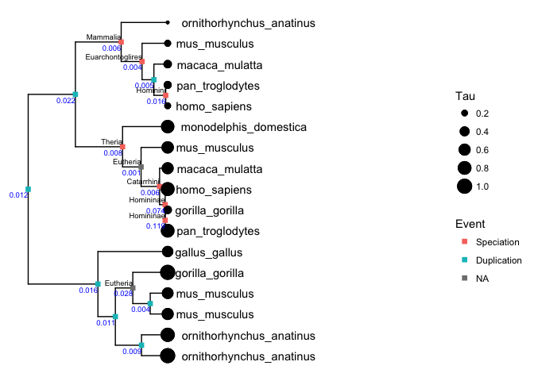

    ## 
    ## [[3]]

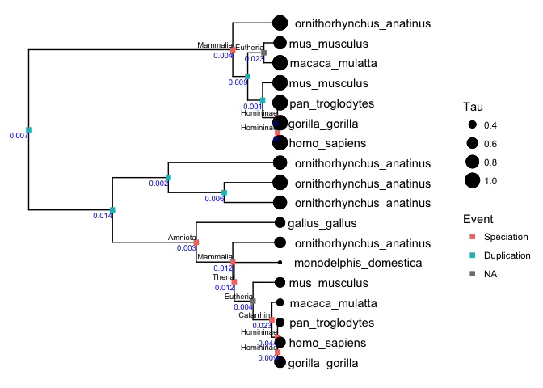

    ## 
    ## [[4]]

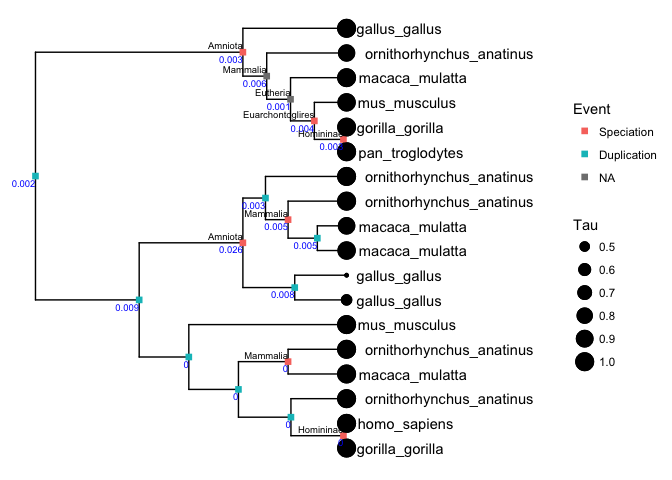

    ## 
    ## [[5]]

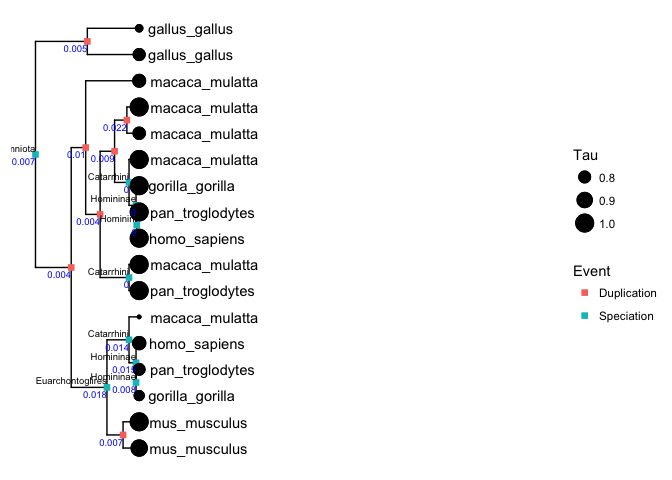

    ## 
    ## [[6]]

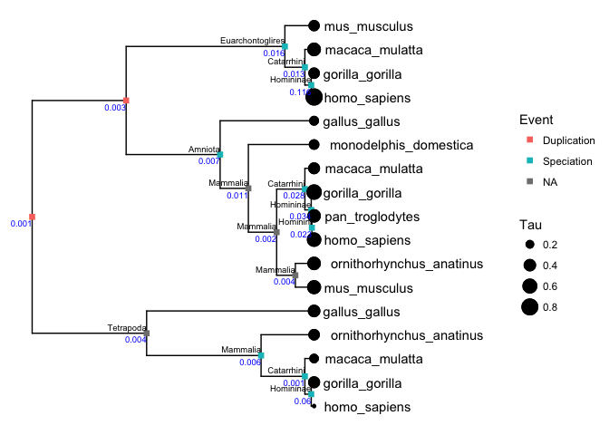

    ## 
    ## [[7]]

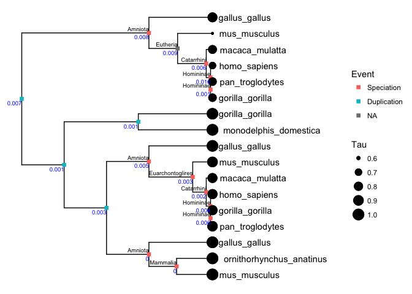

    ## 
    ## [[8]]

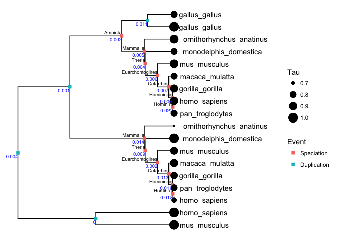

> Supplementary Figure XX\_EXAMPLE\_TREES | A set of example trees to demonstrate the data and analyses that underlie the results. The value of Tau (expression specificity) is indicated by the sizes of the circles at the tips of the tree. Whether an internal node is a speciation or duplication is indicated by color. Speciation nodes are labeled by clade name. Branch lengths are scaled to time. The blue number is the independent contrast for each node.

#### Investigation of potential ascertainment bias

While the age of speciation nodes is constrained, duplication nodes can be much older and therefore have a wider range of ages (Supplementary Figure XXAscertainment a). This is because many gene duplication events are older than the most recent common ancestor of the species in the study. There are also technical factors that can lead to an excess of duplication events deeper in the tree. Gene tree estimation errors errors, for example, tend to lead to the overestimation of deep duplications44. If independent contrast values also tended to to be lower at greater node depth, it could interact with the preponderance of duplications at greater depth to create a pattern of lower contrasts associated with duplication events. To test for such an effect, we remove duplication nodes that are older than the oldest speciation node. Our results are unchanged and this reduced dataset does not reject the null hypothesis that the rate of evolution following duplications is the same as or less than the rate following speciation (Supplementary Figure XXAscertainment b).

The independent contrast across a node is the amount of change observed between the daughter notes, scaled by the expected variance2. The expected variance is principally determined by the lengths of the branches leading from the node to these daughters. The shorter the total length of the two branches leading to daughter nodes, the larger the contrast for a given observed difference. This is because the same difference across a shorter total branch length indicates a greater rate of evolutionary change. The expected variance of contrasts for speciation nodes is constrained by the branch lengths on the species tree, but the expected variance of contrasts for duplications has a much wider range (Figure XXAscertainment c). This could lead to biases if the lengths of branches that descend from duplication nodes tend to be overestimated. We therefore examined only the contrasts that fell within in the range of expected variance seen for speciation contrasts, excluding duplication contrasts that fall outside of this range. This reanalysis does not reject the ortholog conjecture either (Figure XXAscertainment d), indicating that branch length bias is not responsible for the result.

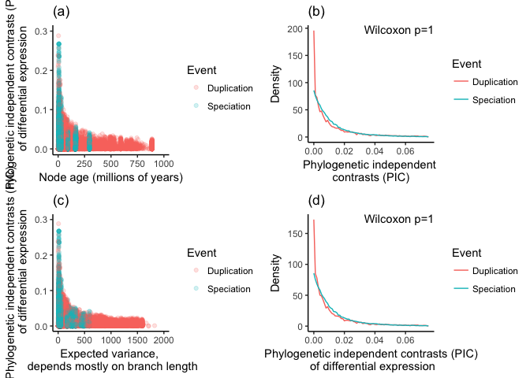

> Supplementary Figure XXAscertainment | Investigation of possible ascertainment biases. (a) Magnitude of independent contrasts plotted against node age. Speciation nodes are calibrated to particular times, whereas duplication nodes have a wider range. (b) Density plot of contrasts for only the nodes that have an age less than or equal to the maximum age of speciation nodes. (c) Magnitude of independent contrasts plotted against expected variance, which is largely determined by branch lengths. Contrasts for speciation nodes have a narrower range of expected variance than do contrasts for duplication nodes. (d) Density plot of contrasts for only the nodes that have expected variance within the range of contrasts across speciation nodes.

#### Investigation of sensitivity to calibration times

We examined the sensitivity of our results to the specification of calibration dates for the speciation nodes. In 10 reanalyses, we drew a new date for each calibration from a normal distribution with the mean of the original date and a standard deviation 0.2 times the original date. If any daugter nodes became older than their parent, we repeated the sampling until the dates were congruent with the topology. The minimum Wilcoxon p in these reanalyses was 1, *i.e.* none of them reject the null hypothesis that the rate of evolution of Tau is greater following duplication events than speciation events. This is consistent with the analysis that uses the calibration dates as specified, indicating that our results are robust to the selection of calibration times for speciation nodes.

References
----------

1. Wray, G. A. Genomics and the Evolution of Phenotypic Traits. *Annual Review of Ecology, Evolution, and Systematics* **44,** 51–72 (2013).

2. Felsenstein, J. Phylogenies and the Comparative Method. *American Naturalist* **125,** 1–15 (1985).

3. Grafen, A. The phylogenetic regression. *Philosophical Transactions of the Royal Society B: Biological Sciences* **326,** 119–157 (1989).

4. Pagel, M. Inferring the historical patterns of biological evolution. *Nature* **401,** 877–884 (1999).

5. FitzJohn, R. G. Diversitree: comparative phylogenetic analyses of diversification in R. *Methods in Ecology and Evolution* **3,** 1084–1092 (2012).

6. Uyeda, J. C. & Harmon, L. J. A Novel Bayesian Method for Inferring and Interpreting the Dynamics of Adaptive Landscapes from Phylogenetic Comparative Data. *Systematic Biology* **63,** 902–918 (2014).

7. *Modern Phylogenetic Comparative Methods and Their Application in Evolutionary Biology*. (Springer Berlin Heidelberg, 2014). doi:[10.1007/978-3-662-43550-2](https://doi.org/10.1007/978-3-662-43550-2)

8. Ricklefs, R. E. & Starck, J. M. Applications of Phylogenetically Independent Contrasts: A Mixed Progress Report. *Oikos* **77,** 167 (1996).

9. Chamberlain, S. A., Hovick, S. M. & Dibble, C. J. Does phylogeny matter? Assessing the impact of phylogenetic information in ecological meta-analysis. *Ecology …* (2012).

10. OMeara, B. C. Evolutionary Inferences from Phylogenies: A Review of Methods. *Annual Review of Ecology, Evolution, and Systematics* **43,** 267–285 (2012).

11. Kryuchkova-Mostacci, N. & Robinson-Rechavi, M. Tissue-Specificity of Gene Expression Diverges Slowly between Orthologs, and Rapidly between Paralogs. *PLoS Computational Biology* **12,** e1005274–13 (2016).

12. Levin, M. *et al.* The mid-developmental transition and the evolution of animal body plans. *Nature* **531,** 637–641 (2016).

13. Nehrt, N. L., Clark, W. T., Radivojac, P. & Hahn, M. W. Testing the Ortholog Conjecture with Comparative Functional Genomic Data from Mammals. *PLoS Computational Biology* **7,** e1002073 (2011).

14. Koonin, E. V. Orthologs, paralogs, and evolutionary genomics. *Annual Review of Genetics* **39,** 309–338 (2005).

15. Kalinka, A. T. *et al.* Gene expression divergence recapitulates the developmental hourglass model. *Nature* **468,** 811–814 (2010).

16. Hejnol, A. & Dunn, C. W. Animal Evolution: Are Phyla Real? *Current Biology* **26,** R424–R426 (2016).

17. Chen, X. & Zhang, J. The Ortholog Conjecture Is Untestable by the Current Gene Ontology but Is Supported by RNA Sequencing Data. *PLoS Computational Biology* **8,** e1002784 (2012).

18. Thomas, P. D. *et al.* On the Use of Gene Ontology Annotations to Assess Functional Similarity among Orthologs and Paralogs: A Short Report. *PLoS Computational Biology* **8,** e1002386 (2012).

19. Forslund, K., Pekkari, I. & Sonnhammer, E. L. Domain architecture conservation in orthologs. *BMC Bioinformatics* **12,** 326 (2011).

20. Brawand, D. *et al.* The evolution of gene expression levels in mammalian organs. *Nature* **478,** 343–348 (2011).

21. Yanai, I. *et al.* Genome-wide midrange transcription profiles reveal expression level relationships in human tissue specification. *Bioinformatics* **21,** 650–659 (2005).

22. Kryuchkova-Mostacci, N. & Robinson-Rechavi, M. A benchmark of gene expression tissue-specificity metrics. *Briefings in bioinformatics* (2016). doi:[10.1093/bib/bbw008](https://doi.org/10.1093/bib/bbw008)

23. Studer, R. A. & Robinson-Rechavi, M. How confident can we be that orthologs are similar, but paralogs differ? *Trends in Genetics* 1–7 (2009). doi:[10.1016/j.tig.2009.03.004](https://doi.org/10.1016/j.tig.2009.03.004)

24. Herrero, J. *et al.* Ensembl comparative genomics resources. *Database : the journal of biological databases and curation* **2016,** bav096–17 (2016).

25. Takahata, N. Gene genealogy in three related populations: consistency probability between gene and population trees. *Genetics* **122,** 957–966 (1989).

26. Degnan, J. H. & Rosenberg, N. A. Gene tree discordance, phylogenetic inference and the multispecies coalescent. *Trends in Ecology & Evolution* **24,** 332–340 (2009).

27. Dunn, C. W. & Munro, C. Comparative genomics and the diversity of life. *Zoologica Scripta* **45,** 5–13 (2016).

28. Gabaldon, T. & Koonin, E. V. Functional and evolutionary implications of gene orthology. *Nature Reviews Genetics* **14,** 360–366 (2013).

29. Yanai, I., Graur, D. & Ophir, R. Incongruent expression profiles between human and mouse orthologous genes suggest widespread neutral evolution of transcription control. *Omics : a journal of integrative biology* **8,** 15–24 (2004).

30. Altenhoff, A. M., Studer, R. A., Robinson-Rechavi, M. & Dessimoz, C. Resolving the ortholog conjecture: orthologs tend to be weakly, but significantly, more similar in function than paralogs. *PLoS Computational Biology* **8,** e1002514 (2012).

31. Domazet-Lošo, T. & Tautz, D. A phylogenetically based transcriptome age index mirrors ontogenetic divergence patterns. *Nature* **468,** 815–818 (2010).

32. Telford, M. J. & Budd, G. E. The place of phylogeny and cladistics in Evo-Devo research. *The International Journal of Developmental Biology* **47,** 479–490 (2003).

33. Hejnol, A. & Lowe, C. J. Embracing the comparative approach: how robust phylogenies and broader developmental sampling impacts the understanding of nervous system evolution. *Philosophical transactions of the Royal Society of London. Series B, Biological sciences* **370,** 20150045–20150045 (2015).

34. Dunn, C. W., Luo, X. & Wu, Z. Phylogenetic analysis of gene expression. *Integrative and Comparative Biology* **53,** 847–856 (2013).

35. Pennell, M. W. & Harmon, L. J. An integrative view of phylogenetic comparative methods: connections to population genetics, community ecology, and paleobiology. *Annals of the New York Academy of Sciences* **1289,** 90–105 (2013).

36. Oakley, T. H., Gu, Z., Abouheif, E., Patel, N. H. & Li, W.-H. Comparative methods for the analysis of gene-expression evolution: an example using yeast functional genomic data. *Molecular Biology and Evolution* **22,** 40–50 (2005).

37. Eng, K. H., Bravo, H. C. & Keleş, S. A phylogenetic mixture model for the evolution of gene expression. *Molecular Biology and Evolution* **26,** 2363–2372 (2009).

38. Chang, D. & Duda, T. F. Application of community phylogenetic approaches to understand gene expression: differential exploration of venom gene space in predatory marine gastropods. *BMC Evolutionary Biology* **14,** 123 (2014).

39. Rohlfs, R. V. & Nielsen, R. Phylogenetic ANOVA: The Expression Variance and Evolution Model for Quantitative Trait Evolution. *Systematic biology* **64,** 695–708 (2015).

40. Yu, G., Smith, D. K., Zhu, H., Guan, Y. & Lam, T. T.-Y. ggtree: an r package for visualization and annotation of phylogenetic trees with their covariates and other associated data. *Methods in Ecology and Evolution* (2016). doi:[10.1111/2041-210X.12628](https://doi.org/10.1111/2041-210X.12628)

41. Daub, J., Moretti, S., Davydov, I. I., Excoffier, L. & Robinson-Rechavi, M. Detection of pathways affected by positive selection in primate lineages ancestral to humans. *bioRxiv* 044941 (2016). doi:[10.1101/044941](https://doi.org/10.1101/044941)

42. Hedges, S. B., Dudley, J. & Kumar, S. TimeTree: a public knowledge-base of divergence times among organisms. *Bioinformatics* **22,** 2971–2972 (2006).

43. Paradis, E., Claude, J. & Strimmer, K. APE: Analyses of Phylogenetics and Evolution in R language. *Bioinformatics* **20,** 289–290 (2004).

44. Hahn, M. W. Bias in phylogenetic tree reconciliation methods: implications for vertebrate genome evolution. *Genome Biology* **8,** R141 (2007).
